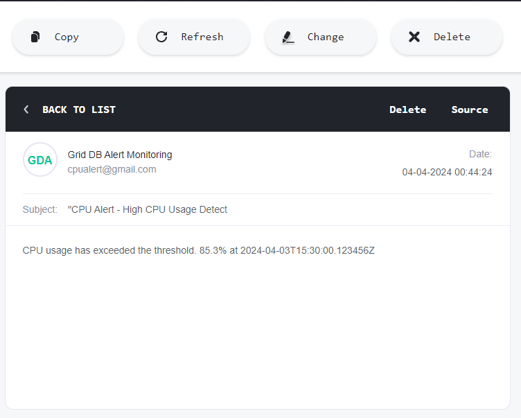

## **Introduction**

In today's fast and data-driven world, the seamless operation of our applications and systems stands as a critical priority. Early detection and resolution of performance issues are critical to prevent downtime, maintain user satisfaction, and optimize resource utilization. Traditional monitoring methods, often relying on intermittent checks and fragmented data sources, struggle to keep pace with the real-time demands of modern applications.

This is where real-time monitoring systems come into play. These applications continuously collect and analyze data, offering a comprehensive view of system health and performance. By proactively identifying anomalies and potential issues, real-time monitoring empowers us to take corrective actions swiftly, minimizing disruptions and ensuring application uptime.

This article explores the power of GridDB, a high-performance time-series database, coupled with Spring Boot, a popular Java framework, to build a robust real-time monitoring system. We'll delve into a practical use case, outlining each step involved in creating this monitoring solution, from setting up the GridDB cluster and configuring the Spring Boot application to implementing alerting mechanisms and notification systems.

## Setting Up GridDB Cluster and Spring Boot Integration: For Real-Time Monitoring

The first step in building our real-time monitoring system involves establishing a solid foundation. This comprises setting up a GridDB cluster and configuring our Spring Boot application to communicate seamlessly with it.

- **Setting up GridDB Cluster**

GridDB offers diverse options to cater to various needs. For development environments, a single-node cluster on your local machine might suffice. however, Production environments often benefit from distributed clusters spread across multiple machines for enhanced fault tolerance and scalability. Refer to the GridDB documentation for detailed instructions on cluster setup based on your chosen deployment strategy.

To set up a GridDB cluster, follow these steps mentioned [here](https://docs.griddb.net/gettingstarted/using-apt/#install-with-apt-get).

- **Setting up Spring Boot Application**

Once your GridDB cluster is up and running, it's time to connect your Spring Boot application. The GridDB Java Client API provides the essential tools for establishing this communication channel. Fortunately, libraries like `griddb-spring-boot-starter` can simplify this process. By including this library as a dependency in your project, you gain access to pre-configured beans that streamline the connection setup.

Within your Spring Boot application, you'll typically configure connection details like cluster names, hostnames, and authentication credentials. These configurations are usually defined in a properties file or directly within your Spring Boot configuration class. With the connection established, your Spring Boot application is now poised to interact with the GridDB cluster and leverage its capabilities for storing and managing your performance metrics.

**Project Structure**

Here's a suggested project structure for such an application:

```shell
.
├── pom.xml
├── src
│   ├── main
│   │   ├── java
│   │   │   └── mycode
│   │   │       ├── config
│   │   │       │   └── GridDBConfig.java
│   │   │       ├── dto
│   │   │       │   └── CpuMetric.java
│   │   │       ├── MySpringBootApplication.java
│   │   │       └── service
│   │   │           ├── AlertingService.java
│   │   │           └── MetricsCollectionService.java
│   │   └── resources
│   │       └── application.properties
```

This structure delineates distinct layers for controllers, models, repositories, services, and the application entry point, promoting modularity and maintainability. Additionally, it encompasses resource files such as application properties and logging configurations, alongside testing suites for ensuring robustness.

**Add GridDB Dependency**

To interact with GridDB in your Spring Boot project, you'll need to include the GridDB Java Client API dependency. This can be done by adding the necessary configuration to your project's build file, either `pom.xml` for Maven or the equivalent file for Gradle.

Here's an example of how to configure the dependency in your `pom.xml` file:

```xml
<project xmlns="http://maven.apache.org/POM/4.0.0"
  xmlns:xsi="http://www.w3.org/2001/XMLSchema-instance"
  xsi:schemaLocation="http://maven.apache.org/POM/4.0.0 http://maven.apache.org/maven-v4_0_0.xsd">
  <modelVersion>4.0.0</modelVersion>
  <groupId>com.example</groupId>
  <artifactId>my-griddb-app</artifactId>
  <version>1.0-SNAPSHOT</version>
  <name>my-griddb-app</name>
  <url>http://maven.apache.org</url>
  <parent>
    <groupId>org.springframework.boot</groupId>
    <artifactId>spring-boot-starter-parent</artifactId>
    <version>3.2.4</version>
    <relativePath /> <!-- lookup parent from repository -->
  </parent>
  <properties>
    <maven.compiler.source>17</maven.compiler.source>
    <maven.compiler.target>17</maven.compiler.target>
  </properties>

  <dependencies>
    <dependency>
      <groupId>org.springframework.boot</groupId>
      <artifactId>spring-boot-starter-actuator</artifactId>
    </dependency>
    <dependency>
      <groupId>junit</groupId>
      <artifactId>junit</artifactId>
      <version>3.8.1</version>
      <scope>test</scope>
    </dependency>
    <!-- https://mvnrepository.com/artifact/com.github.griddb/gridstore-jdbc -->
    <dependency>
      <groupId>com.github.griddb</groupId>
      <artifactId>gridstore-jdbc</artifactId>
      <version>5.3.0</version>
    </dependency>
    <dependency>
      <groupId>com.github.griddb</groupId>
      <artifactId>gridstore</artifactId>
      <version>5.5.0</version>
    </dependency>
    <dependency>
      <groupId>org.springframework.boot</groupId>
      <artifactId>spring-boot-starter-web</artifactId>
      <exclusions>
        <exclusion>
          <groupId>org.springframework.boot</groupId>
          <artifactId>spring-boot-starter-logging</artifactId>
        </exclusion>
      </exclusions>
    </dependency>
    <dependency>
      <groupId>org.springframework.boot</groupId>
      <artifactId>spring-boot-starter-test</artifactId>
      <scope>test</scope>
    </dependency>
    <dependency>
      <groupId>org.projectlombok</groupId>
      <artifactId>lombok</artifactId>
      <optional>true</optional>
    </dependency>
  </dependencies>
</project>
```

**Configure GridDB Connection**

Once you've added the GridDB dependency, configure the connection details for your GridDB cluster in your Spring Boot application properties file (typically named `application.properties`). This file allows you to define various application settings.

Here's an example of how to configure the connection details:

```properties
GRIDDB_NOTIFICATION_MEMBER=127.0.0.1:10001
GRIDDB_CLUSTER_NAME=myCluster
GRIDDB_USER=admin
GRIDDB_PASSWORD=admin
management.endpoints.web.exposure.include=*
```

- `griddb.cluster.host`: The hostname or IP address of your GridDB cluster.
- `griddb.cluster.port`: The port number on which the GridDB cluster is listening.
- `griddb.cluster.user`: The username for accessing the GridDB cluster.
- `griddb.cluster.password`: The password for the specified GridDB user (replace with your actual password).

**Create GridDB Client Bean**

Create a Spring Bean to initialize the GridDB connection using the configured parameters. This bean will be used to interact with the GridDB cluster throughout your application. This is done in GridDbConfig.java as below interacts with GridDB effectively in your Spring Boot application, you'll need a dedicated bean to manage the GridDB connection. This bean will be responsible for initializing the connection using the configuration parameters you specified in the `application.properties` file. Once created, this bean will serve as a central point for interacting with the GridDB cluster throughout your application.

Here's an example of how to define such a bean in a Java class named `GridDbConfig.java`:

```java
package mycode.config;

import java.util.Properties;

import org.springframework.beans.factory.annotation.Value;
import org.springframework.context.annotation.Bean;
import org.springframework.context.annotation.Configuration;
import org.springframework.context.annotation.PropertySource;

import com.toshiba.mwcloud.gs.GSException;
import com.toshiba.mwcloud.gs.GridStore;
import com.toshiba.mwcloud.gs.GridStoreFactory;

@Configuration
@PropertySource("classpath:application.properties")
public class GridDBConfig {

  @Value("${GRIDDB_NOTIFICATION_MEMBER}")
  private String notificationMember;

  @Value("${GRIDDB_CLUSTER_NAME}")
  private String clusterName;

  @Value("${GRIDDB_USER}")
  private String user;

  @Value("${GRIDDB_PASSWORD}")
  private String password;

  @Bean
  public GridStore gridStore() throws GSException {
    // Acquiring a GridStore instance
    Properties properties = new Properties();
    properties.setProperty("notificationMember", notificationMember);
    properties.setProperty("clusterName", clusterName);
    properties.setProperty("user", user);
    properties.setProperty("password", password);
    return GridStoreFactory.getInstance().getGridStore(properties);
  }
}
```

## Metric Collection

Having established the groundwork with GridDB and Spring Boot integration, we can now delve into the crucial aspects of data collection and schema design. These steps define the structure and organization of the performance metrics we intend to monitor.

**Leveraging Spring Actuator for Seamless Metric Collection**

Spring Boot Actuator is a powerful tool that simplifies application monitoring by exposing various endpoints. These endpoints provide valuable insights into the application's health, performance, and configuration. In our scenario, Spring Actuator acts as the primary source for collecting key performance metrics. By integrating with Spring Actuator's relevant endpoints, your Spring Boot application can gather crucial data points such as:

- Memory usage (heap, non-heap)
- Garbage collection activity
- CPU utilization
- Thread pool statistics
- HTTP request latencies and error rates

This example demonstrates how to access CPU utilization metrics in your Spring Boot application

Spring Boot Actuator exposes various endpoints for monitoring and managing your application. One such endpoint, `/actuator/metrics/system.cpu.usage`, provides data about the CPU usage of the system where your application is running. This endpoint typically returns a JSON response containing the CPU usage as a percentage value.

To access all actuator endpoints, including the CPU usage endpoint, you might need to adjust your Spring Boot configuration. By adding the following property to your `application.properties` file, you expose all actuator endpoints:

```properties
management.endpoints.web.exposure.include=*
```

Once the configuration is set up, you can access the CPU usage endpoint using a tool like Postman or by directly sending an HTTP GET request to the following URL:

```
http://localhost:<port>/actuator/metrics/system.cpu.usage
```

Replace `<port>` with the actual port number on which your Spring Boot application is running. This endpoint typically returns a JSON response containing details about CPU usage. 

The exact format of the response might vary depending on your Spring Boot version and configuration. However, it usually includes the CPU usage as a percentage value.

```json
{
  "name": "system.cpu.usage",
  "measurements": [
    {
      "statistic": "VALUE",
      "value": 0.25
    }
  ],
  "availableTags": []
}
```

**Implementation of Scheduled Tasks**

To monitoring at predefined intervals, we need to utilize the spring schedular approach. These tasks collect performance metrics from various sources, such as application logs, system metrics, and external APIs, and store them in GridDB for analysis.

Spring Boot provides a built-in scheduling mechanism that allows you to automate tasks at predefined intervals. In this context, we'll leverage scheduled tasks to collect and store performance metrics in GridDB for further analysis.

**Task Functionality:**

The scheduled tasks will be responsible for:

- **Collecting Performance Metrics:** These metrics can be retrieved from various sources, including application logs, system metrics (like CPU usage), and external APIs.
- **Storing Data in GridDB:** The collected metrics will be processed and stored in GridDB for efficient analysis.

```java
package mycode.service;

import java.util.Date;

import org.springframework.beans.factory.annotation.Autowired;
import org.springframework.http.HttpStatus;
import org.springframework.http.ResponseEntity;
import org.springframework.scheduling.annotation.Scheduled;
import org.springframework.stereotype.Service;
import org.springframework.web.client.HttpClientErrorException;
import org.springframework.web.client.RestTemplate;

import com.fasterxml.jackson.databind.JsonNode;
import com.fasterxml.jackson.databind.ObjectMapper;
import com.toshiba.mwcloud.gs.*;

import mycode.dto.CpuMetric;

@Service
public class MetricsCollectionService {
  @Autowired
  GridStore store;

  @Scheduled(fixedRate = 6000) // Collect metrics every minute
  public void collectMetrics() throws GSException {
    // Fetch CPU usage metrics from Spring Boot Actuator endpoint
    double cpuUsage = getCPUUsageFromActuator();
    Date timestamp = new Date();

    // Create a CPU metric object
    CpuMetric cpuMetric = new CpuMetric(timestamp, cpuUsage);

    // Store the metric in GridDB
    System.out.println("Fetching CPU metrics at current time");
    TimeSeries<CpuMetric> ts = store.putTimeSeries("cpuMetrics", CpuMetric.class);
    ts.append(cpuMetric);
  }

  private double getCPUUsageFromActuator() {
    String actuatorUrl = "http://localhost:8080/actuator/metrics/system.cpu.usage";
    RestTemplate restTemplate = new RestTemplate();
    try {
      ResponseEntity<String> responseEntity = restTemplate.getForEntity(actuatorUrl, String.class);

      if (responseEntity.getStatusCode() == HttpStatus.OK) {
        ObjectMapper mapper = new ObjectMapper();
        JsonNode root = mapper.readTree(responseEntity.getBody());
        JsonNode measurements = root.path("measurements");

        if (measurements.isArray() && measurements.size() > 0) {
          JsonNode valueNode = measurements.get(0).path("value");
          if (valueNode.isDouble())
            return valueNode.asDouble();
        }
      }
    } catch (HttpClientErrorException e) {
      // Handle HTTP client errors
      System.err.println("HTTP error: " + e.getMessage());
    } catch (Exception e) {
      // Handle other exceptions
      System.err.println("Error: " + e.getMessage());
    }

    // Return a default value if unable to fetch or parse the CPU usage
    return -1.0;
  }
}
```

Storing Processed Data in GridDB: To store performance metrics efficiently, we'll define a dedicated schema within GridDB.

Here's an example of a schema class named `CpuMetric` that represents CPU usage data:

```java
package mycode.dto;

import lombok.AllArgsConstructor;
import lombok.Data;
import lombok.NoArgsConstructor;
import java.util.Date;

import com.toshiba.mwcloud.gs.RowKey;

@Data
@NoArgsConstructor
@AllArgsConstructor
public class CpuMetric {
  @RowKey
  public Date timestamp;
  public double cpuUsage;
}
```

## 

**Dynamic CPU Usage Threshold with GridDB**

Traditional CPU monitoring often relies on static thresholds, risking false positives or missing critical situations. This section explores a dynamic approach for setting CPU usage thresholds based on historical data stored in GridDB.

In this approach, we'll utilize a dynamic threshold methodology to calculate CPU usage based on historical data. We'll start by fetching historical CPU metrics from GridDB, covering a defined timeframe. Next, we'll process this data, calculating aggregate metrics such as total CPU usage and the count of data points. This allows us to compute the average CPU usage over the specified period. Finally, leveraging historical trends and deviations, we'll determine a dynamic threshold tailored to the current system state. This approach ensures adaptability to system fluctuations and facilitates proactive monitoring and alerting for anomalous CPU behavior.

The **calculateDynamicThreshold ** method serves a critical role in monitoring system health by analyzing historical CPU metrics stored in GridDB and dynamically determining a suitable threshold for CPU usage.

```java
package mycode.service;

import java.io.IOException;
import java.text.SimpleDateFormat;
import java.time.Instant;
import java.util.Date;
import java.util.List;
import java.util.concurrent.TimeUnit;

import org.springframework.beans.factory.annotation.Autowired;
import org.springframework.scheduling.annotation.Scheduled;
import org.springframework.stereotype.Service;

import com.toshiba.mwcloud.gs.Container;
import com.toshiba.mwcloud.gs.GridStore;
import com.toshiba.mwcloud.gs.Query;
import com.toshiba.mwcloud.gs.Row;
import com.toshiba.mwcloud.gs.RowSet;

import mycode.dto.CpuMetric;

@Service
public class AlertingService {

  private final double cpuUsageThreshold = 90.0; // CPU usage threshold in percentage
  @Autowired
  GridStore store;

  @Scheduled(fixedRate = 60000) // Check metrics every minute
  public void monitorAndAlert() throws Exception {
    // Fetch the latest CPU metric from GridDB

    double currentThreshold = c sendAlertOException ex) {
      ex.printStackTrace();
    }
  }

  private double calculateDynamicThreshold() throws Exception {

    Container<?, Row> container = store.getContainer("cpuMetrics");
    if (container == null) {
      throw new Exception("Container not found.");
    }

    SimpleDateFormat dateFormat = new SimpleDateFormat("yyyy-MM-dd'T'HH:mm:ss.SSS'Z'");
    Date now = new Date();
    Date sixHoursAgo = new Date(now.getTime() - TimeUnit.HOURS.toMillis(6));

    String nowString = dateFormat.format(now);
    String sixHoursAgoString = dateFormat.format(sixHoursAgo);

    String queryString = "select * where timestamp >= TIMESTAMP('" + sixHoursAgoString
        + "') and timestamp <= TIMESTAMP('" + nowString + "')";
    System.out.println(queryString);
    Query<Row> query = container.query(queryString);
    // Fetch the results using RowSet
    RowSet<Row> rs = query.fetch();

    // Process the fetched CPU metrics
    double totalCpuUsage = 0.0;
    int count = 0;
    while (rs.hasNext()) {
      Row row = rs.next();
      Double cpuUsage = row.getDouble(1);
      totalCpuUsage += cpuUsage;
      count++;
      System.out
          .println("Timestamp: " + row.getTimestamp(0) + ", CPU Usage: " + row.getDouble(1));
    }

    // Calculate the average CPU usage over the past six hours
    double averageCpuUsage = (count > 0) ? (totalCpuUsage / count) : 0.0;

    // Perform additional calculations based on averageCpuUsage and return the
    // result
    double dynamicThreshold = calculateThreshold(averageCpuUsage);

    return dynamicThreshold;
  }

  private double calculateThreshold(double averageCpuUsage) {
    return averageCpuUsage * 1.2;
  }

}
```

When a metric violation is detected by the continuous monitoring module, our Spring Boot application needs to generate an alert object encapsulating relevant information. This object typically includes details such as:

- **Metric Name:** The specific metric that breached the threshold.
- **Threshold Violated:** The particular threshold that was exceeded.
- **Current Value:** The actual value of the metric at the time of violation.
- **Timestamp:** The exact time the violation occurred.

To use a third-party API like SendGrid to send emails in your `sendAlert()` method, you'll first need to integrate the SendGrid Java library into your project. Then you can use the SendGrid API to send emails.The `sendAlert` method can leverage a third-party API like SendGrid to deliver email notifications. To achieve this, you'll need to integrate the SendGrid Java library into your project. Here's how you can do it:

- Add the SendGrid dependency to your `pom.xml`:
  
  ```xml
  <dependency>
      <groupId>com.sendgrid</groupId>
      <artifactId>sendgrid-java</artifactId>
      <version>4.8.0</version>
  </dependency>
  ```

- Configure your SendGrid API key and other properties in `application.properties`:

```properties
sendgrid.api.key=YOUR_SENDGRID_API_KEY
```

- Implement the `sendAlert()` method using SendGrid:

```java
  public void sendAlert(double cpuUsage) {
    Email from = new Email("your@example.com");
    String subject = "CPU Alert - High CPU Usage Detected";
    Email to = new Email("admin@example.com");
    Content content = new Content("text/plain",
        "CPU usage has exceeded the threshold." + cpuUsage + "at" + Instant.now());
    Mail mail = new Mail(from, subject, to, content);

    SendGrid sg = new SendGrid(sendGridApiKey);
    Request request = new Request();
    try {
      request.setMethod(Method.POST);
      request.setEndpoint("mail/send");
      request.setBody(mail.build());
      Response response = sg.api(request);
      System.out.println(response.getStatusCode());
      System.out.println(response.getBody());
      System.out.println(response.getHeaders());
    } catch (IOException ex) {
      ex.printStackTrace();
    }
  }
```

with this, it will trigger the email as below:



### Running the Project

To run the project, Execute the following command to build and run your application:

```shell
mvn clean install && mvn spring-boot:run  
```

Upon successful execution of the command, you should see an output similar to the following in your terminal window:

```shell
[INFO] Attaching agents: []
SLF4J(W): Class path contains multiple SLF4J providers.
SLF4J(W): Found provider [ch.qos.logback.classic.spi.LogbackServiceProvider@5fa7e7ff]
SLF4J(W): Found provider [org.slf4j.jul.JULServiceProvider@4629104a]
SLF4J(W): See https://www.slf4j.org/codes.html#multiple_bindings for an explanation.
SLF4J(I): Actual provider is of type [ch.qos.logback.classic.spi.LogbackServiceProvider@5fa7e7ff]

  .   ____          _            __ _ _
 /\\ / ___'_ __ _ _(_)_ __  __ _ \ \ \ \
( ( )\___ | '_ | '_| | '_ \/ _` | \ \ \ \
 \\/  ___)| |_)| | | | | || (_| |  ) ) ) )
  '  |____| .__|_| |_|_| |_\__, | / / / /
 =========|_|==============|___/=/_/_/_/
 :: Spring Boot ::             my-griddb-app)
2024-04-05T16:55:48.101+05:30  INFO 1271 --- [           main] mycode.MySpringBootApplication           : No active profile set, falling back to 1 default profile: "default"
2024-04-05T16:55:50.941+05:30  INFO 1271 --- [           main] o.s.b.w.embedded.tomcat.TomcatWebServer  : Tomcat initialized with port 8080 (http)
2024-04-05T16:55:50.971+05:30  INFO 1271 --- [           main] o.apache.catalina.core.StandardService   : Starting service [Tomcat]
2024-04-05T16:55:50.971+05:30  INFO 1271 --- [           main] o.apache.catalina.core.StandardEngine    : Starting Servlet engine: [Apache Tomcat/10.1.19]
2024-04-05T16:55:51.092+05:30  INFO 1271 --- [           main] o.a.c.c.C.[Tomcat].[localhost].[/]       : Initializing Spring embedded WebApplicationContext
2024-04-05T16:55:51.093+05:30  INFO 1271 --- [           main] w.s.c.ServletWebServerApplicationContext : Root WebApplicationContext: initialization completed in 2876 ms
2024-04-05T16:55:53.025+05:30  INFO 1271 --- [           main] o.s.b.a.e.web.EndpointLinksResolver      : Exposing 13 endpoint(s) beneath base path '/actuator'
2024-04-05T16:55:53.143+05:30  INFO 1271 --- [           main] o.s.b.w.embedded.tomcat.TomcatWebServer  : Tomcat started on port 8080 (http) with context path ''
2024-04-05T16:55:53.163+05:30  INFO 1271 --- [           main] mycode.MySpringBootApplication           : Started MySpringBootApplication in 6.047 seconds (pr24-04-05T16:55:53.328Z')
2024-04-05T16:55:53.647+05:30  INFO 1271 --- [nio-8080-exec-1] o.a.c.c.C.[Tomcat].[localhost].[/]       : Initializing Spring DispatcherServlet 'dispatcherServlet'
2024-04-05T16:55:53.648+05:30  INFO 1271 --- [nio-8080-exec-1] o.s.web.servlet.DispatcherServlet        : Initializing Servlet 'dispatcherServlet'
2024-04-05T16:55:53.649+05:30  INFO 1271 --- [nio-8080-exec-1] o.s.web.servlet.DispatcherServlet        : Completed initialization in 1 ms
Fetching CPU metrics at current time
Fetching CPU metrics at current time
Fetching CPU metrics at current time
Fetching CPU metrics at current time
Fetching CPU metrics at current time
Timestamp: Fri Apr 05 16:55:59 IST 2024, CPU Usage: 0.004949328305444261
Timestamp: Fri Apr 05 16:56:05 IST 2024, CPU Usage: 0.0020863759649488835
Timestamp: Fri Apr 05 16:56:11 IST 2024, CPU Usage: 0.001875390706397166
Timestamp: Fri Apr 05 16:56:17 IST 2024, CPU Usage: 0.001665972511453561
Timestamp: Fri Apr 05 16:56:23 IST 2024, CPU Usage: 0.001669449081803005
Timestamp: Fri Apr 05 16:56:29 IST 2024, CPU Usage: 6.253908692933083E-4
Timestamp: Fri Apr 05 16:56:35 IST 2024, CPU Usage: 0.0016677089847821555
Timestamp: Fri Apr 05 16:56:41 IST 2024, CPU Usage: 0.0010412328196584756
Timestamp: Fri Apr 05 16:56:47 IST 2024, CPU Usage: 6.264355815410315E-4hing CPU metrics at current time
```

Once the CPU usage surpasses the dynamically calculated threshold, the `sendAlert` method will be triggered. This method, as mentioned earlier, can leverage a third-party API like SendGrid to send notification emails about the potential CPU overload.

**Data Storage in GridDB:**

While alerts are sent for real-time monitoring, the collected CPU metrics are continuously stored in your internal GridDB instance for historical analysis and future reference. You can access and query this data using the GridDB Shell tool as below.

```shell
$ gs_sh
Loading "/var/lib/gridstore/.gsshrc"
SLF4J: Class path contains multiple SLF4J bindings.
SLF4J: Found binding in [jar:file:/usr/share/java/griddb-cli.jar!/org/slf4j/impl/StaticLoggerBinder.class]
SLF4J: Found binding in [jar:file:/usr/gridstore/lib/logback-classic-1.0.13.jar!/org/slf4j/impl/StaticLoggerBinder.class]
SLF4J: See http://www.slf4j.org/codes.html#multiple_bindings for an explanation.
SLF4J: Actual binding is of type [ch.qos.logback.classic.util.ContextSelectorStaticBinder]
The connection attempt was successful(NoSQL).
The connection attempt was successful(NewSQL).
gs[public]> SELECT * FROM cpuMetrics;
65 results. (14 ms)
gs[public]> get 65
+--------------------------+-----------------------+
| Timestamp                | CpuUsage              |
+--------------------------+-----------------------+
| 2024-04-03T18:37:16.331Z | 0.0048760521050437682 |
| 2024-04-05T11:27:23.156Z | 8.333333333333334E-4  |
| 2024-04-05T11:27:29.073Z | 8.347245409015025E-4  |
| 2024-04-05T11:27:35.091Z | 8.340283569641367E-4  |
| 2024-04-05T11:27:41.107Z | 6.256517205422314E-4  |
| 2024-04-05T11:27:47.123Z | 0.0010444955086693127 |
| 2024-04-05T11:27:53.137Z | 8.335069806209627E-4  |
| 2024-04-05T11:27:59.153Z | 6.255212677231026E-4  |
| 2024-04-05T11:28:05.070Z | 4.1718815185648727E-4 |
| 2024-04-05T11:28:11.086Z | 6.256517205422315E-4  |
| 2024-04-05T11:28:17.097Z | 6.252605252188412E-4  |
| 2024-04-05T11:28:23.109Z | 0.0012513034410844628 |
| 2024-04-05T11:28:29.125Z | 0.0025010421008753647 |
| 2024-04-05T11:28:35.141Z | 0.004586199708150928  |
| 2024-04-05T11:28:41.154Z | 0.01920267167605928   |
| 2024-04-05T11:28:47.069Z | 0.0018769551616266945 |
| 2024-04-05T11:28:53.334Z | 0.0018575851393188856 |
| 2024-04-05T11:28:59.149Z | 0.0021235931195582925 |
| 2024-04-05T11:29:05.166Z | 0.0014583333333333334 |
| 2024-04-05T11:29:11.083Z | 0.0022921441967076474 |
| 2024-04-05T11:29:17.099Z | 0.002082032063293775  |
| 2024-04-05T11:29:23.116Z | 8.350730688935282E-4  |
| 2024-04-05T11:29:29.132Z | 6.256517205422314E-4  |
| 2024-04-05T11:29:35.148Z | 8.338544923910778E-4  |
| 2024-04-05T11:29:41.162Z | 0.001043187982474442  |
| 2024-04-05T11:29:47.077Z | 0.0014601585314977055 |
| 2024-04-05T11:29:53.093Z | 0.004372267332916927  |
| 2024-04-05T11:29:59.111Z | 0.0010438413361169101 |
| 2024-04-05T11:30:05.125Z | 0.0012505210504376823 |
| 2024-04-05T11:30:11.142Z | 0.0010423181154888472 |
| 2024-04-05T11:30:17.155Z | 0.01943979933110368   |
| 2024-04-05T11:30:23.070Z | 0.0014595496246872393 |
| 2024-04-05T11:30:29.086Z | 8.340283569641367E-4  |
| 2024-04-05T11:30:35.231Z | 0.002073828287017835  |
+--------------------------+-----------------------+
The 65 results had been acquired.
```

### **Conclusion:**

In summary, the integration of GridDB with Spring Boot offers a potent solution for real-time monitoring and alerting in modern applications. By leveraging GridDB's high-performance Java Client API, developers can efficiently store and query key performance metrics. Coupled with Spring Boot's robust framework, this integration facilitates the implementation of continuous monitoring and the development of responsive notification systems.

Through efficient schema design and dynamic configuration, developers can tailor monitoring solutions to their specific needs, ensuring timely detection and resolution of anomalies. With the ability to integrate email, SMS, or Slack notification services, stakeholders can stay informed and respond promptly to critical events.

In essence, GridDB and Spring Boot enable developers to build agile and reliable monitoring systems, enhancing application reliability, performance, and user satisfaction in today's fast-paced digital landscape.